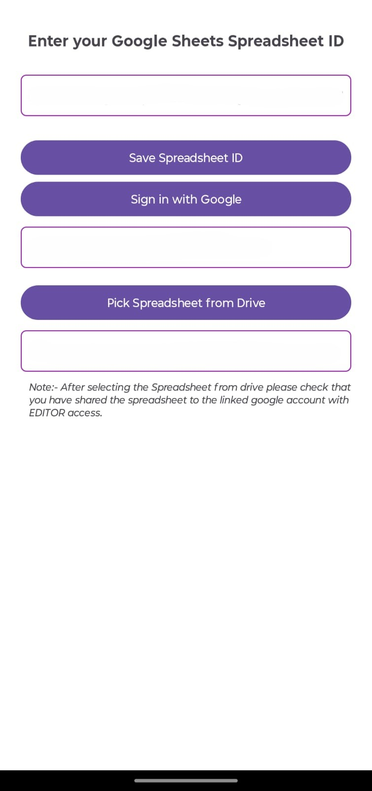
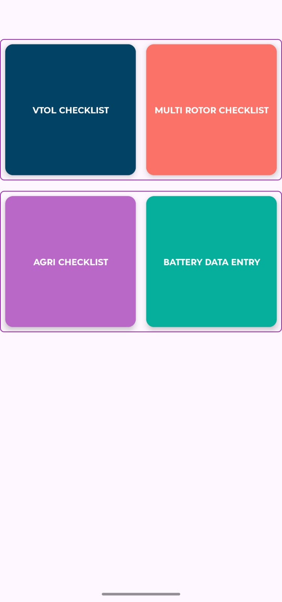
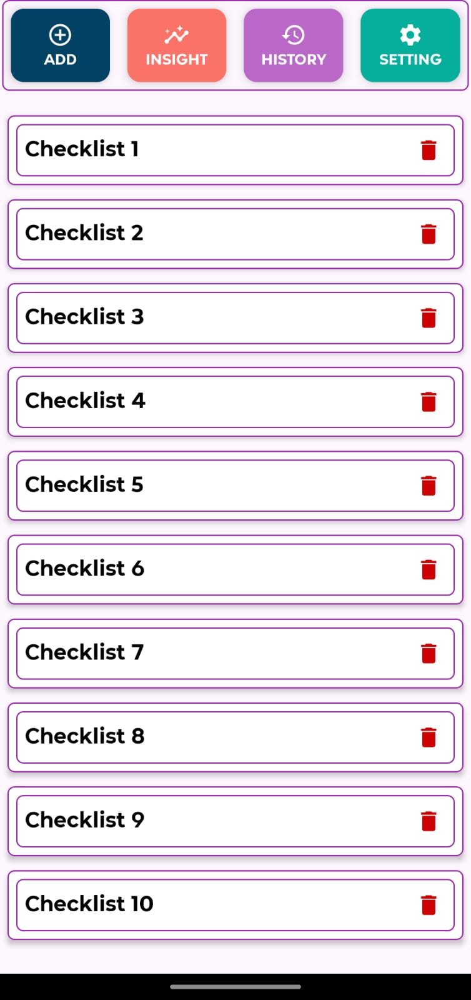
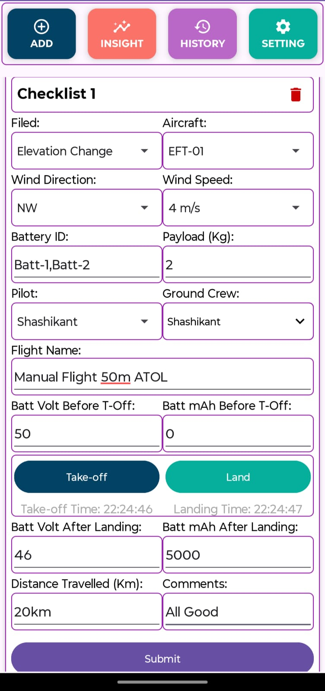
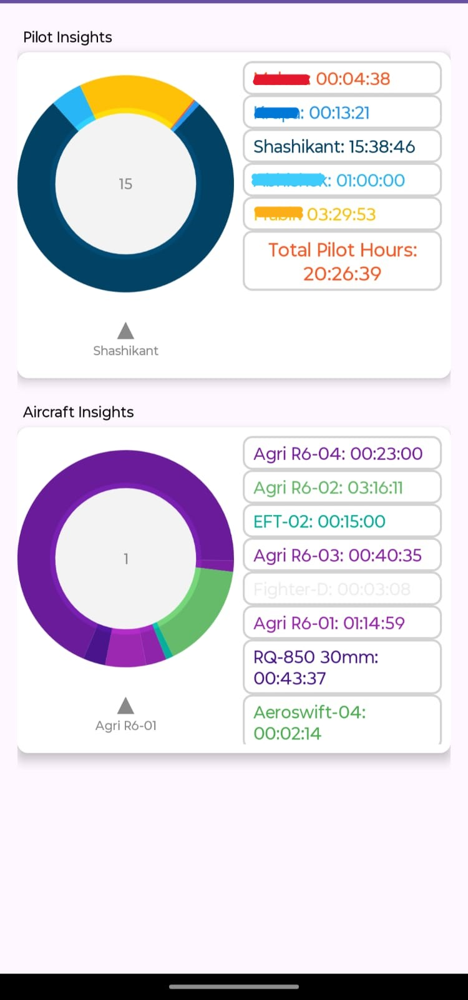
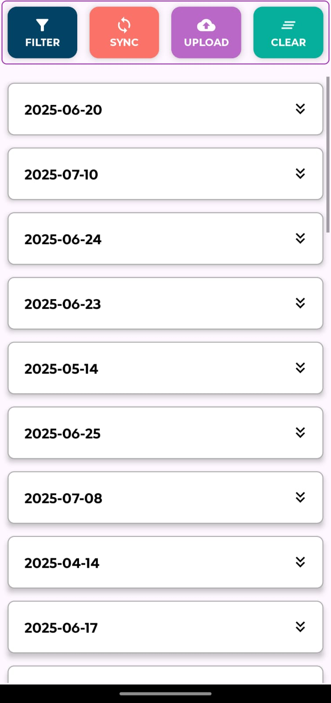
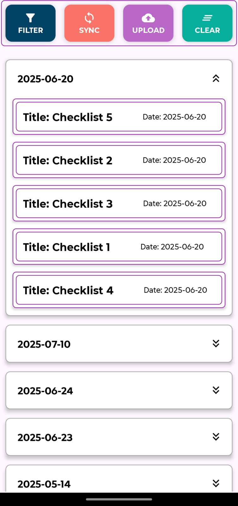
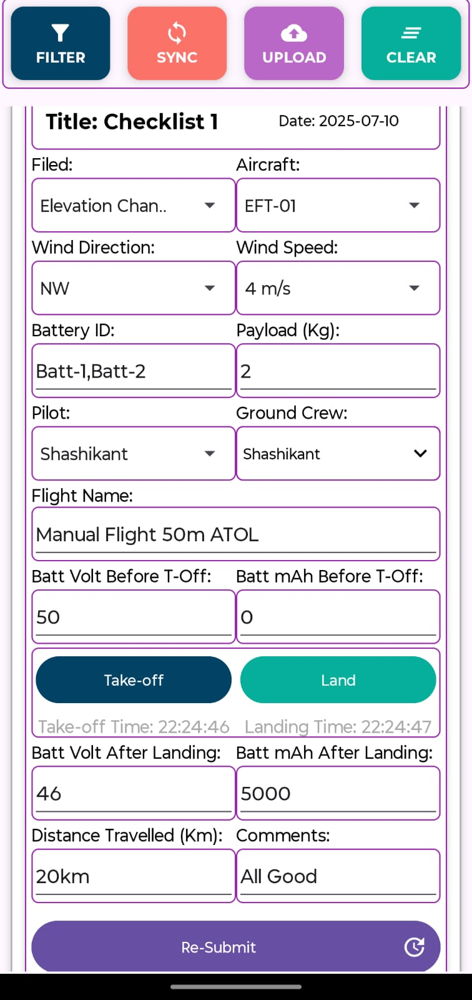
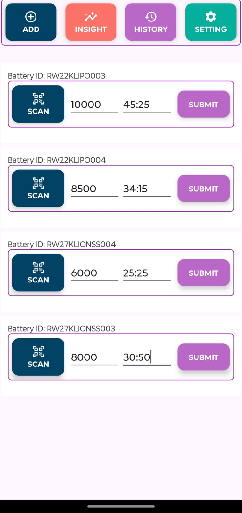

# UAV-Checklist-Application- Project Showcase 🚀

This project is a showcase of **UAV-Checklist-Application**, an Android application that can be used to fill UAV checklists like **Pre-Flight / In-Flight / Post-Flight**.
This app can be used for different types of UAVs like **VTOL, Fixedwings, Multirotors, Battery Charging Data by scanning the QR codes**.

## 📱 Key Features
- User login with Google
- Google Spreadsheet Connect
- Real-time data sync
- Insights
- History data sync > edit > resubmit
- Responsive UI 

## 🔧 Tech Stack
- Java
- Git & GitHub for version control

## 📸 Screenshots

| Login Screen | Dashboard |
|--------------|-----------|
|  |  |

| VTOL Checklist Main Page | Checklist Sample |
|--------------|-----------|
|  |  |

| Insights | Sync Data |
|--------------|-----------|
|  |  |

| Checklist History | History Data Re-Submit |
|--------------|-----------|
|  |  |

| Battery Main Page | Battery ID Scan |
|--------------|-----------|
|  |  |

| Battery Data Entry |  |
|--------------|-----------|
|  | |

## 📂 Code Access
🔒 Source code is private for IP protection.  
📩 **Contact me** to request full access:  
📧 `sramteke2110@gmail.com`

## 📄 Project Summary
See the [project overview PDF](docs/MyApp_Overview.pdf) for architecture and use cases.

---

_This repo is intended for portfolio/demo purposes._
